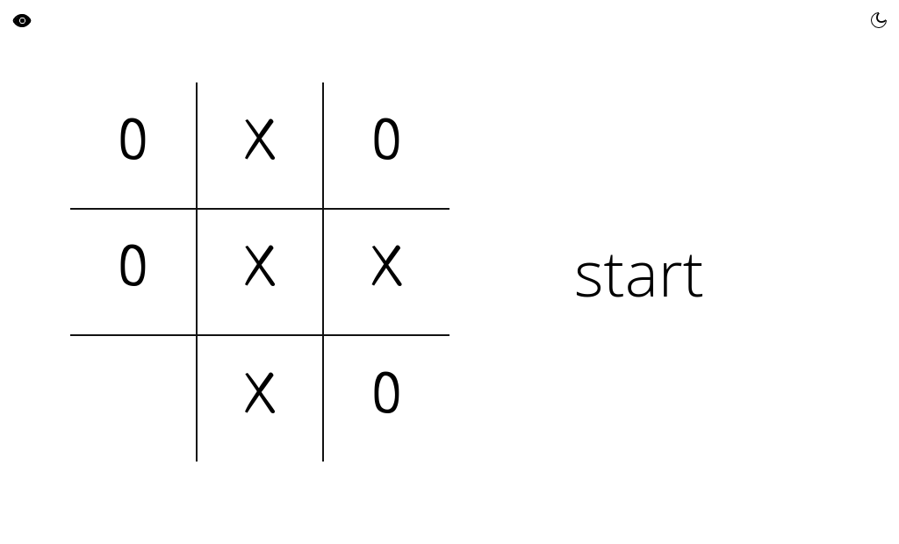
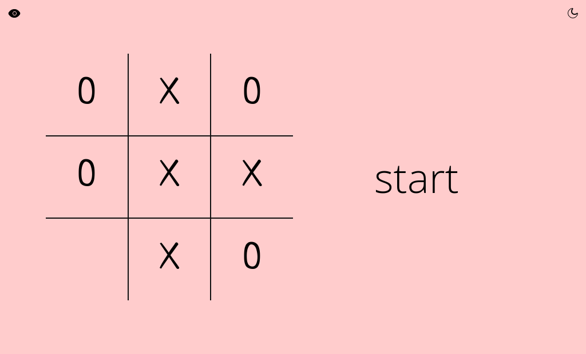
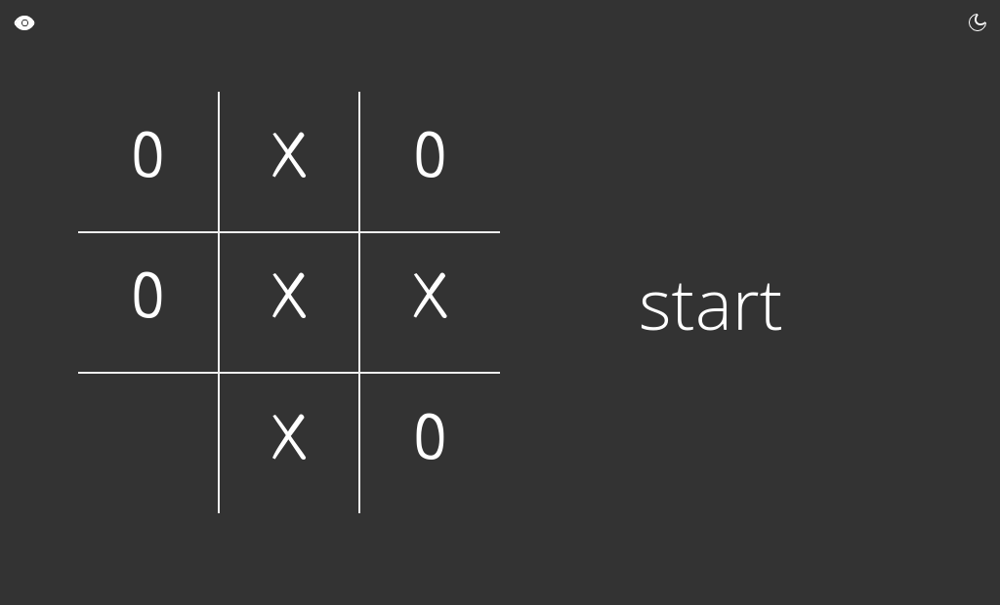
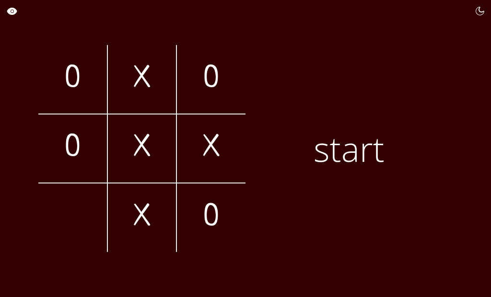

# tic-tac-toe

Clean JavaScript tic-tac-toe game with light/dark theme, minimax AI and
localStorage profile. [Visit it here](https://dreadsd.github.io/tic-tac-toe/).

## Usage
Use the eye icon to toggle automatic mode (minimax AI) and the moon icon to
toggle dark mode. Click `start` when ready.

## Screenshots
### Light theme

### Light theme, automatic mode

### Dark theme

### Dark theme, automatic mode


## Development
```sh
git clone https://github.com/dreadsd/tic-tac-toe.git
cd tic-tac-toe
```
## License
[MIT](https://opensource.org/licenses/MIT)

Thanks to [Astrit Malsija](https://github.com/astrit) for his
[CSS icons](https://css.gg/).
